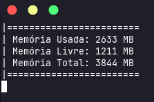

## Monitor de Memória Ram com NodeJS


### Requisitos (ter instalado na máquina):
* Git
* NodeJS (v14)

### Como usar:
Abra seu terminal e digite o comando:
``` sh
  git clone https://github.com/th1ag0-Zz/monitor-de-memoria.git
```

Depois abra o terminal na pasta onde o projeto foi clonado e rode o comando

``` sh
  node app.js
```

Para encerrar a aplicação basta apertar as teclas ``` Ctrl + C ``` no seu teclado.
